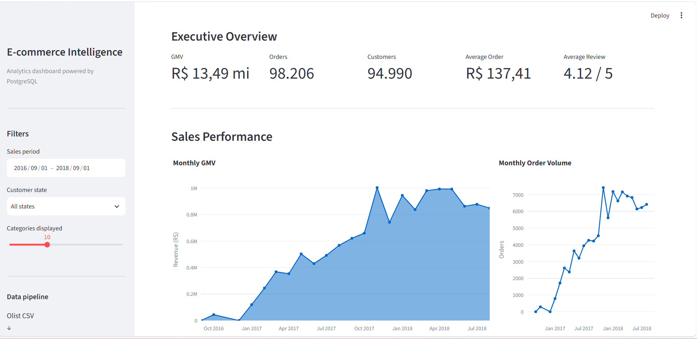
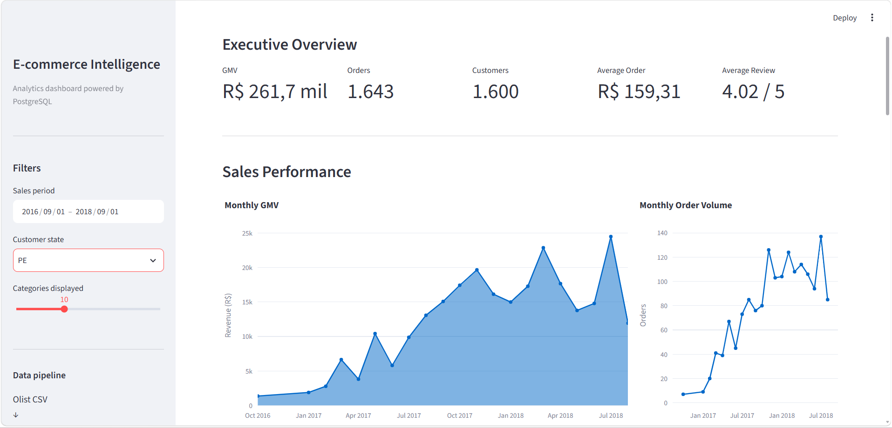

# E-commerce Intelligence

[](https://github.com/VladisonCosta/ecom-intelligence/actions/workflows/tests.yml)

End-to-end data engineering and analytics project built with Python, PostgreSQL, SQL, Pandas, Plotly and Streamlit using the Brazilian E-Commerce Public Dataset by Olist.

The project transforms raw e-commerce data into a relational PostgreSQL database, performs data quality validation, creates analytical SQL views and exposes business metrics through an interactive dashboard.

## Live Demo

The interactive dashboard is publicly available on Streamlit Community Cloud:

**[Open the E-commerce Intelligence Dashboard](https://ecom-intelligence-vladison.streamlit.app)**

> The application uses a cloud-hosted PostgreSQL database and may take a few seconds to wake up after a period of inactivity.

## Dashboard

### Executive Overview

The dashboard provides an overview of sales performance, customers and business KPIs, including GMV, number of orders, unique customers, average order value and average review score.



### Interactive Analysis

Users can filter the analysis by sales period and Brazilian customer state. KPIs and sales charts are recalculated according to the selected filters.

Example below showing customers from Pernambuco (PE):



## Architecture

```text
Olist CSV Dataset
        |
        v
Python ETL Pipeline
        |
        +-- Data inspection
        +-- Data transformation
        +-- Data quality checks
        |
        v
PostgreSQL
        |
        +-- Relational schema
        +-- Analytical views
        +-- Business queries
        |
        v
Python / Pandas
        |
        v
Streamlit + Plotly
        |
        v
Interactive Analytics Dashboard
```

## Data Pipeline

The project implements an ETL pipeline responsible for loading the Olist datasets into PostgreSQL.

The pipeline processes data related to:

- customers
- orders
- order items
- payments
- reviews
- products
- sellers
- product category translations

After loading the datasets, row-count validation is performed between the source CSV files and PostgreSQL tables to verify that the expected number of records was loaded.

## Data Quality

Data inspection and validation are part of the pipeline.

The project checks characteristics such as:

- dataset dimensions
- column names
- missing values
- duplicated rows
- source and database row counts

Dedicated SQL queries are also available in:

```text
sql/002_data_quality_checks.sql
```

## Analytics Layer

Analytical SQL views provide reusable business metrics for the dashboard and exploratory analysis.

Implemented views include:

```text
vw_order_metrics
vw_monthly_sales
vw_category_performance
vw_customer_metrics
vw_delivery_performance
vw_seller_performance
```

Additional business queries are available in:

```text
sql/004_business_queries.sql
```

## Business Metrics

The analytics layer supports metrics such as:

- Gross Merchandise Value (GMV)
- Total orders
- Unique customers
- Average order value
- Average review score
- Monthly sales performance
- Monthly order volume
- Product category performance
- Customer recurrence
- Delivery performance
- Seller performance

## Interactive Filters

The Streamlit dashboard currently supports:

- sales period filtering
- customer state filtering
- number of product categories displayed

The dashboard queries PostgreSQL and recalculates the relevant metrics according to the selected filters.

## Tech Stack

| Technology | Usage |
|---|---|
| Python | ETL, data processing and application logic |
| PostgreSQL | Relational database and analytics layer |
| SQL | Schema, data quality checks, views and business queries |
| Pandas | Data manipulation and analytical processing |
| Streamlit | Interactive dashboard |
| Plotly | Data visualization |
| Git / GitHub | Version control and project repository |

## Project Structure

```text
ecom-intelligence/
|
+-- dashboard/
|   +-- app.py
|
+-- data/
|   +-- raw/                 # Local raw datasets (not versioned)
|
+-- docs/
|   +-- images/
|       +-- dashboard-overview.png
|       +-- dashboard-filtered.png
|
+-- sql/
|   +-- 001_create_schema.sql
|   +-- 002_data_quality_checks.sql
|   +-- 003_analytics_views.sql
|   +-- 004_business_queries.sql
|
+-- src/
|   +-- analytics.py
|   +-- database.py
|   +-- inspect_data.py
|   +-- load_customers.py
|   +-- pipeline.py
|
+-- .gitignore
+-- README.md
+-- requirements.txt
```

## Running the Project

### 1. Clone the repository

```bash
git clone https://github.com/VladisonCosta/ecom-intelligence.git
cd ecom-intelligence
```

### 2. Create a virtual environment

```bash
python -m venv .venv
```

Activate it on Windows:

```powershell
.\.venv\Scripts\Activate.ps1
```

### 3. Install dependencies

```bash
pip install -r requirements.txt
```

### 4. Configure PostgreSQL

Create a local `.env` file with the database configuration required by the application.

The `.env` file is intentionally excluded from version control.

### 5. Create the database schema

Execute:

```text
sql/001_create_schema.sql
```

against the PostgreSQL database.

### 6. Add the dataset

Place the Olist CSV files inside:

```text
data/raw/
```

Raw datasets are not stored in this repository.

### 7. Run the ETL pipeline

```bash
python src/pipeline.py
```

### 8. Create the analytical views

Execute:

```text
sql/003_analytics_views.sql
```

against the PostgreSQL database.

### 9. Run the dashboard

```bash
streamlit run dashboard/app.py
```

The application will then be available through the local Streamlit server.

## Dataset

This project uses the Brazilian E-Commerce Public Dataset by Olist.

The dataset contains information about orders, customers, products, sellers, payments, reviews and logistics from a Brazilian e-commerce marketplace.

The raw dataset is intentionally not included in this repository.

## Project Goals

This project was developed to practice and demonstrate an end-to-end analytics workflow involving:

- data ingestion
- ETL development
- relational data modeling
- SQL analytics
- data quality validation
- business metric development
- interactive data visualization
- version control with Git

## Future Improvements

Possible future improvements include:

- automated testing
- containerization with Docker
- CI/CD pipeline
- cloud deployment
- pipeline orchestration
- additional analytical dimensions

## Author

**Vladison Costa**

Computer Science student focused on Software Engineering, Data and Backend development.

GitHub: `VladisonCosta`